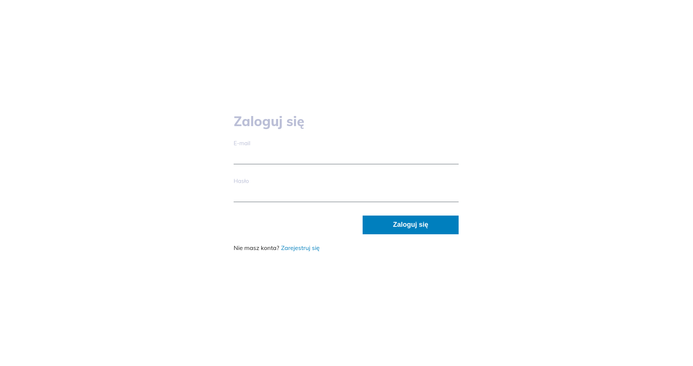
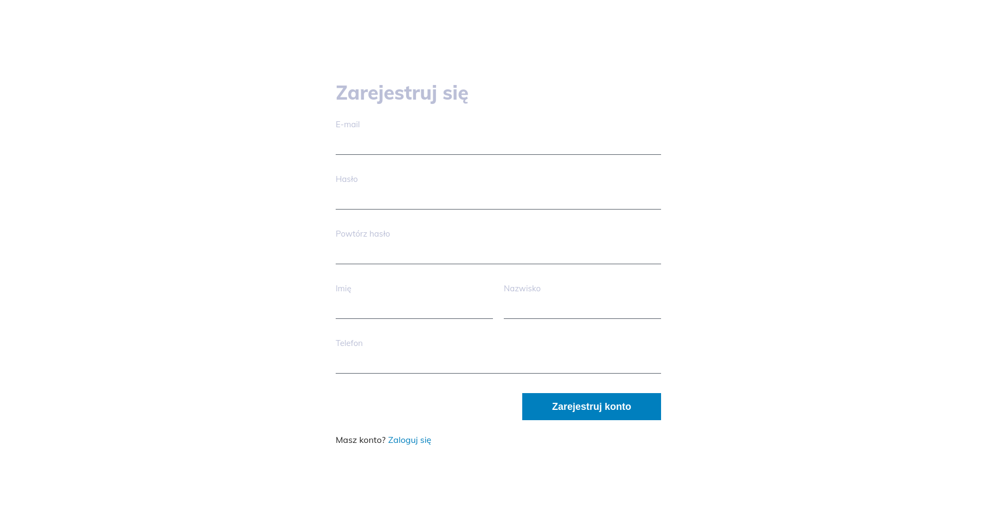
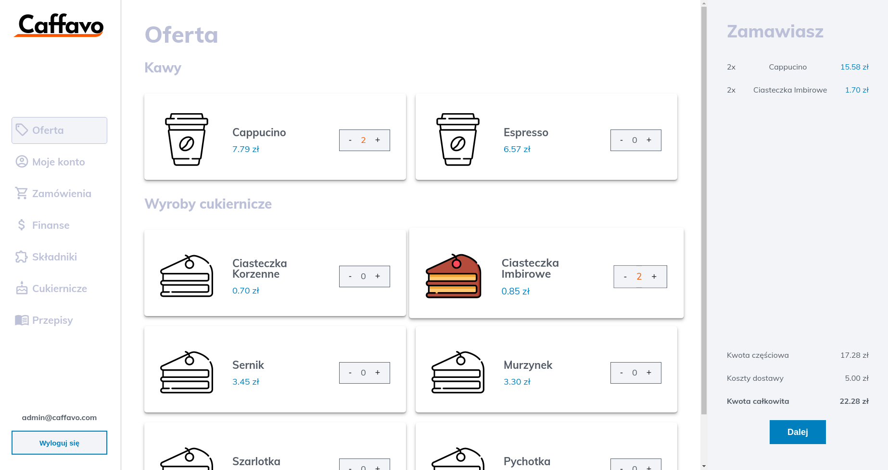
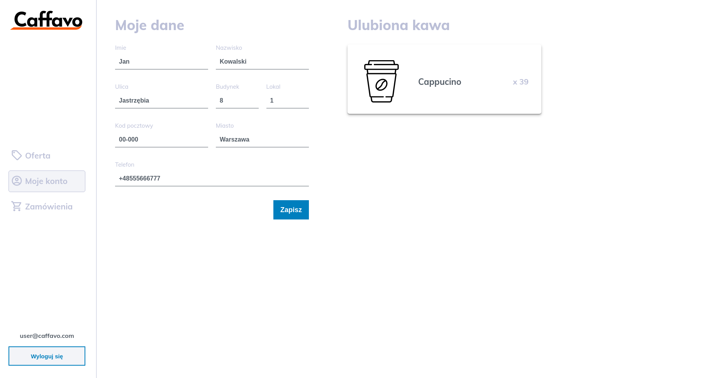
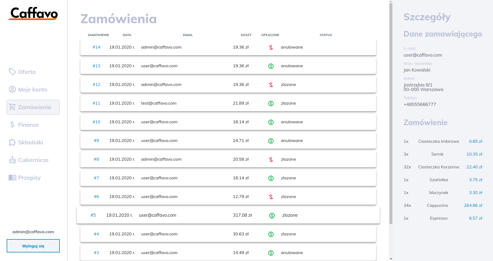
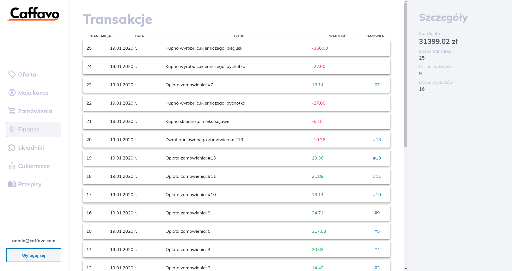
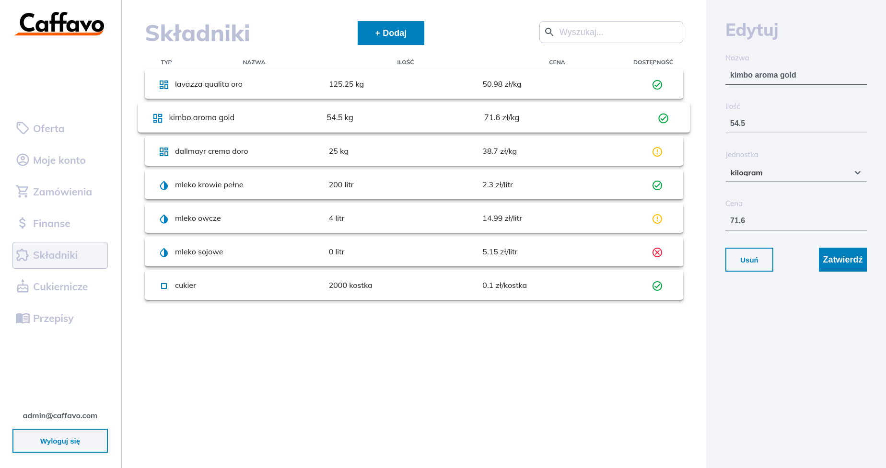
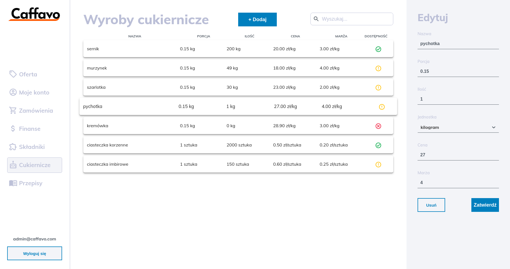
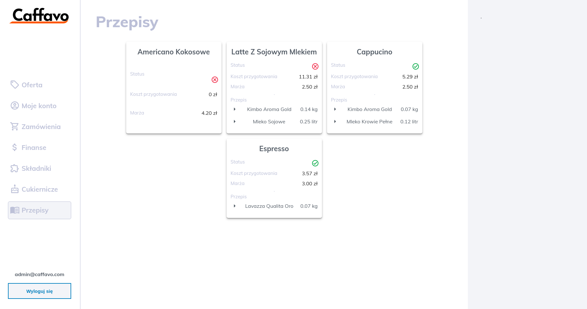

# Caffavo
Firma poświęcona parzeniu i dostarczaniu kawy.

[https://kacperkapusciak.github.io/caffavo-fe/](https://kacperkapusciak.github.io/caffavo-fe/)

Przykładowe konto użytkownika:
```
Login: user-2@caffavo.com
Hasło: 1234567890
```
Przykładowe konto administratora:
```$xslt
Login: admin@caffavo.com
Hasło: password
```

## Założenia projektowe:
### Ogólnie dla systemu:
- [x] Każdy rodzaj kawy ma swój przepis.
- [ ] Po przygotowaniu kawy jest zużywana odpowiednia ilość składników.

#### System umozliwia zarządzanie:
- [x] ilością składników dostępnych w magazynie (kilogramy kawy, cukru, litry mleka, syropów etc.)
- [x] zamówieniami, użytkownikami, przepisami, rodzajami kawy oraz składnikami
- [x] Kalkulować koszt danego zamówienia:
koszt zamówenia = ilość kaw * (cena składników + marża) + ilość produktów * (cena + marża) + koszt dostawy. 'Produktem' jest np. sernik, szarlotka, ciastko itp.
- [x] Blokować możliwość zamawiania kaw na które nie ma składników
- [x] Na bieżąco kalkulować ilość kaw które mogą zostać zaparzone z danych składników oraz informować administratora o brakach.

#### Jako użytkownik mogę:
- [x] zarejestrować się na stronie
- [x] edytować swoje dane, również adresowe (imię, nazwisko, telefon, email, haslo, adres zamieszkania
- [x] przeglądać menu dostępnych kaw oraz produktów wraz z ich cenami
- [x] złożyć zamówienie na kawy/produkty przeze mnie wybrane, poznać koszt zamówienia i status jego realizacji w każdym z jego etapów (przyjęte do realizacji, w trakcie, anulowane, zrealizowane) 
- [x] anulować zamówienie (do 5 minut po złożeniu zamówienia)
- [ ] wyrazic swoje zadowolenie w postaci opinii do zrealizowanego zamówienia
- [x] mieć podgląd na moje zamówienia, również przeszłe
- [x] poznac moją ulubioną kawę - najczesciej przeze mnie zamawianą

#### Jako administator mogę:
- [ ] dodawać nowe rodzaje składników, przepisów, produktów i rodzajów kawy
- [x] uzupełniać braki w magazynach tj. kupować składniki, produkty
- [x] zarządzać finansami - bilans konta, pieniądze z zamówień, koszta składników, koszta dostawy, nadawanie marży na produkty oraz kawy
- [x] zarządzać zamówieniami, znać ich stan, ilość, edytować, tworzyć, usuwać
- [x] znać najpopularniejsze kawy zamawiane przez klientów
- [ ] mieć możliwość poznania opinii klientów i umieszczania na stronie głównej

Zaznaczone pola oznajmiają, które założenia udało się zrealizować.

## Diagramy
### Diagram Przepływu Danych
Diagram można znaleźć pod: [diagrams/DFD.pdf](diagrams/DFD.pdf)

### Diagram ERD
Diagram znajduje się pod: [diagrams/ERD.pdf](diagrams/ERD.pdf)

## Projekt logiczny
Tabele, typy oraz widoki wraz z komentarzami znajdują się w pliku [sql/init.sql](sql/init.sql).

Triggery można znaleźć w pliku [sql/triggers.sql](sql/triggers.sql).

## Operacje na danych

#### Autoryzacja

##### Logowanie użytkownika: [routes/auth.js#L43](routes/auth.js#L43)
```sql
SELECT id, email, admin 
FROM uzytkownik 
WHERE email=${email} AND haslo=${password};
```

##### Rejestracja/dodawanie użytkowników: 
[routes/users.js#L154](routes/users.js#L154)
```sql
INSERT INTO uzytkownik (email, haslo) 
VALUES (${email}, ${password})`);
```
[routes/users.js#L158](routes/users.js#L158)
```sql
INSERT INTO uzytkownik (email, haslo, imie, nazwisko, telefon) 
VALUES (${email}, ${password}, ${firstName}, ${lastName}, ${phone})`);;
```

#### Użytkownicy

##### Wyświetlenie wszystkich użytkowników: [routes/users.js#L46](routes/users.js#L46)
```sql
SELECT * FROM uzytkownik;
```

##### Dane o użytkowniku przy podanym id: [routes/users.js#L99](routes/users.js#L99)
```sql
SELECT * FROM pelne_dane_uzytkownika
WHERE id=${req.params.id};
```

##### Edycja danych użytkownika
[routes/users.js#L202](routes/users.js#L202)
```sql
UPDATE uzytkownik
SET imie=${firstName}, nazwisko=${lastName}, telefon=${phone}
WHERE id=${req.params.id}
RETURNING adres_id;
```

[routes/users.js#L210](routes/users.js#L210)
```sql
UPDATE adres
SET ulica=${street}, nr_budynku=${building},
nr_lokalu=${apartment}, kod_pocztowy=${postal},
miasto=${city}
WHERE id=${rows[0].adres_id};
```

[routes/users.js#L218](routes/users.js#L218)
```sql
INSERT INTO adres (ulica, nr_budynku, nr_lokalu, kod_pocztowy, miasto)
VALUES (${street}, ${building}, ${apartment}, ${postal}, ${city})
RETURNING id;
```

[routes/users.js#L224](routes/users.js#L224)
```sql
UPDATE uzytkownik
SET adres_id=${id}
WHERE id=${req.params.id};
```

##### Usunięcie użytkownika: [routes/users.js#L241](routes/users.js#L241)
```sql
DELETE FROM uzytkownik
WHERE id=${req.params.id};
```

#### Składniki

##### Wypisanie wszystkich składników: [routes/ingredients.js#L41](routes/ingredients.js#L41)
```sql
SELECT * FROM skladniki ORDER BY jednostka ASC, ilosc DESC;
```

##### Dodawanie składnika: [routes/ingredients.js#L84](routes/ingredients.js#L84)
```sql
INSERT INTO skladniki (nazwa, ilosc, jednostka, cena)
VALUES (${name}, ${amount}, ${unit}, ${price})`);
```

##### Edycja składnika: [routes/ingredients.js#L122](routes/ingredients.js#L122)
```sql
UPDATE skladniki
SET nazwa=${name}, ilosc=${amount}, jednostka=${unit}, cena=${price}
WHERE id=${req.params.id}`);
```

##### Usunięcie składnika: [routes/ingredients.js#L141](routes/ingredients.js#L141)
```sql
DELETE FROM skladniki
WHERE id=${req.params.id}`);
```

#### Wyroby cukiernicze

##### Wypisanie wyrobów cukierniczych: [routes/bakery.js#L45](routes/bakery.js#L45)
```sql
SELECT * FROM wyroby_cukiernicze ORDER BY jednostka ASC, ilosc DESC;
```

##### Dodawanie wyrobu cukierniczego: [routes/bakery.js#L94](routes/bakery.js#L94)
```sql
INSERT INTO wyroby_cukiernicze (nazwa, porcja, ilosc, jednostka, cena, marza)
VALUES (${name}, ${portion}, ${amount}, ${unit}, ${price}, ${priceMargin});
```

##### Edycja wyrobu cukierniczego: [routes/bakery.js#L137](routes/bakery.js#L137)
```sql
UPDATE wyroby_cukiernicze
SET
    nazwa=${name}, 
    porcja=${portion}, 
    ilosc=${amount}, 
    jednostka=${unit}, 
    cena=${price}, 
    marza=${priceMargin}
WHERE id=${req.params.id};
```

##### Usunięcie wyrobu cukierniczego: [routes/bakery.js#L163](routes/bakery.js#L163)
```sql
DELETE FROM wyroby_cukiernicze
WHERE id=${req.params.id}`);
```

#### Zamówienia

##### Wyświetlenie wszystkich zamówień: [routes/orders.js#L49](routes/bakery.js#L49)
```sql
SELECT z.id, uzytkownik_id, email, z.adres_id, status, data_zlozenia,
data_realizacji, koszt, koszt_dostawy, oplacone, opinie_id
FROM zamowienia z
JOIN uzytkownik u
ON z.uzytkownik_id = u.id
ORDER BY data_zlozenia DESC;
```

##### Wyświetla zamówienia użytkownika o podanym id: [routes/orders.js#112](routes/orders.js#112)
```sql
SELECT id, status, data_zlozenia, data_realizacji,
koszt, koszt_dostawy, oplacone, opinie_id FROM zamowienia
WHERE uzytkownik_id=${req.params.id}
ORDER BY data_zlozenia DESC;
```

##### Wyświetla pełne dane o zamówieniu:
[routes/orders.js#208](routes/orders.js#208)
```sql
SELECT * FROM zamowienia
WHERE id=${req.params.id};
```
[routes/orders.js#214](routes/orders.js#214)
```sql
SELECT * FROM zamowione_produkty
WHERE zamowienie_id=${req.params.id}
```
[routes/orders.js#221](routes/orders.js#221)
```sql
SELECT * FROM pelne_dane_uzytkownika
WHERE id=${userId};
```

##### Dodawanie nowego zamówienia: 
[routes/orders.js#313](routes/orders.js#313)
```sql
SELECT ${obj.amount} * cena as price
FROM oferta_kaw
WHERE rodzaj_kawy_id=${obj.coffeeTypeId};
```
[routes/orders.js#324](routes/orders.js#324)
```sql
SELECT ${obj.amount} * cena as price
FROM oferta_wyrobow_cukierniczych
WHERE wyrob_cukierniczy_id=${obj.bakeryId};
```
[routes/orders.js#335](routes/orders.js#335)
```sql
INSERT INTO zamowienia (uzytkownik_id, koszt) 
VALUES (${userId}, ${totalOrderCost})
RETURNING id;
```
[routes/orders.js#344](routes/orders.js#344)
```sql
INSERT INTO zamowiony_produkt (zamowienie_id, ilosc) 
VALUES (${orderId}, ${coffee.amount})
RETURNING id;
```
[routes/orders.js#350](routes/orders.js#350)
```sql
INSERT INTO zamowiona_kawa (zamowiony_produkt_id, rodzaj_kawy_id) 
VALUES (${orderedItemId}, ${coffee.coffeeTypeId});
```
[routes/orders.js#357](routes/orders.js#357)
```sql
INSERT INTO zamowiony_produkt (zamowienie_id, ilosc) 
VALUES (${orderId}, ${bakeryItem.amount})
RETURNING id;
```
[routes/orders.js#363](routes/orders.js#363)
```sql
INSERT INTO zamowiony_wyrob_cukierniczy (zamowiony_produkt_id, wyrob_cukierniczy_id) 
VALUES (${orderedItemId}, ${bakeryItem.bakeryId});
```

##### Opłacenie zamówienia: 
[routes/orders.js#380](routes/orders.js#380)
```sql
UPDATE zamowienia
SET oplacone='true'
WHERE id=${id}
RETURNING koszt, koszt_dostawy;
```
[routes/orders.js#393](routes/orders.js#393)
```sql
INSERT INTO transakcje (wartosc, tytul, zamowienie_id)
VALUES (${paymentValue}, ${paymentTitle}, ${id});
```
##### Anulowanie zamówienia:
[routes/orders.js#409](routes/orders.js#409)
```sql
SELECT data_zlozenia FROM zamowienia
WHERE id=${id};
```
[routes/orders.js#419](routes/orders.js#419)
```sql
UPDATE zamowienia
SET status='anulowane'
WHERE id=${id}
RETURNING oplacone, koszt, koszt_dostawy;
```
[routes/orders.js#430](routes/orders.js#430)
```sql
INSERT INTO transakcje (wartosc, tytul, zamowienie_id)
VALUES (${-(parseFloat(koszt) + parseFloat(koszt_dostawy))}, ${title}, ${id});
```

##### Usunięcie zamówienia o podanym id: [routes/orders.js#446](routes/orders.js#446)
```sql
DELETE FROM zamowienia
WHERE id=${req.params.id};
```

#### Oferta
##### Wyświetlenie dostępnej oferty:
[routes/offer.js#39](routes/offer.js#39)
```sql
SELECT * FROM oferta_kaw;
```
[routes/offer.js#40](routes/offer.js#40)
```sql
SELECT * FROM oferta_wyrobow_cukierniczych;
```

##### Najczęściej zamawiana kawa:
[routes/offer.js#88](routes/offer.js#88)
```sql
SELECT uk.rodzaj_kawy_id, nazwa, cena, SUM(ile_razy_zamowiona) as ile_razy_zamowiona 
FROM ulubiona_kawa uk
INNER JOIN oferta_kaw ok
ON uk.rodzaj_kawy_id = ok.rodzaj_kawy_id
GROUP BY uk.rodzaj_kawy_id, nazwa, cena
ORDER BY ile_razy_zamowiona DESC
LIMIT 1;
```

#### Finanse
##### Wyświetlenie wszystkich transakcji: [routes/finance.js#39](routes/finance.js#39)
```sql
SELECT * FROM transakcje ORDER BY wykonana_o DESC;
```
##### Wyświetlenie wszystkich transakcji użytkownika o podanym id: [routes/finance.js#84](routes/finance.js#84)
```sql
SELECT
  t.id, t.wykonana_o, t.wartosc, t.tytul, t.zamowienie_id
FROM transakcje t
INNER JOIN zamowienia z
ON t.zamowienie_id = z.id
WHERE z.uzytkownik_id=${req.params.id};
```
##### Informacje o stanie konta bankowego: [routes/finance.js#126](routes/finance.js#126)
```sql
SELECT * FROM konto_bankowe;
```

#### Kawy
##### Wyświetlenie kaw wraz z przepisami:
[routes/coffee.js#59](routes/coffee.js#59)
```sql
SELECT * FROM rodzaje_kawy;
```
[routes/coffee.js#72](routes/coffee.js#72)
```sql
SELECT rodzaj_kawy_id, skladnik_id, p.ilosc, nazwa, jednostka
FROM przepisy p
JOIN skladniki s
ON p.skladnik_id = s.id;
```
##### Dodawanie kawy wraz z przepisem:
[routes/coffee.js#135](routes/coffee.js#135)
```sql
INSERT INTO rodzaje_kawy (nazwa, marza)
VALUES (${name}, ${priceMargin})
RETURNING id;
```
[routes/coffee.js#143](routes/coffee.js#143)
```sql
INSERT INTO przepisy (rodzaj_kawy_id, skladnik_id, ilosc)
VALUES (${coffeeId}, ${item.id}, ${item.amount});
```

##### Usunięcie kawy: 
[routes/coffee.js#163](routes/coffee.js#163)
```sql
DELETE FROM przepisy
WHERE rodzaj_kawy_id=${id};
```
[routes/coffee.js#168](routes/coffee.js#168)
```sql
DELETE FROM rodzaje_kawy
WHERE id=${id};
```

## Interfejs graficzny
#### Ekran logowania

#### Ekran rejestracji

#### Oferta

#### Szczegóły konta

#### Ekran zamówień

#### Potwierdzenie zamówienia

#### Finanse

#### Składniki

#### Wyroby cukiernicze

#### Przepisy


## Wprowadzanie danych
Inicjalizacja danych w bazie odbywa się poprzez import pliku [sql/populate.sql](sql/populate.sql). 
Następnie dane mogą być wprowadzane ręcznie przy pomocy formularzy. Niektóre dane takie jak
cena kawy, status kawy, składnika, wyrobu cukierniczego bądź zamówienia aktualizowane są automatycznie poprzez triggery.

## Dokumentacja kodu
Znajduje się w kodzie.

## Wykaz literatury
* [https://node-postgres.com/](https://node-postgres.com/)
* [https://www.taniarascia.com/node-express-postgresql-heroku/](https://www.taniarascia.com/node-express-postgresql-heroku/)
* [https://www.postgresql.org/docs/12/index.html](https://www.postgresql.org/docs/12/index.html)


